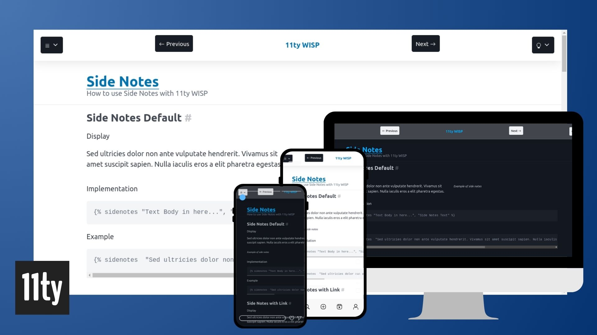
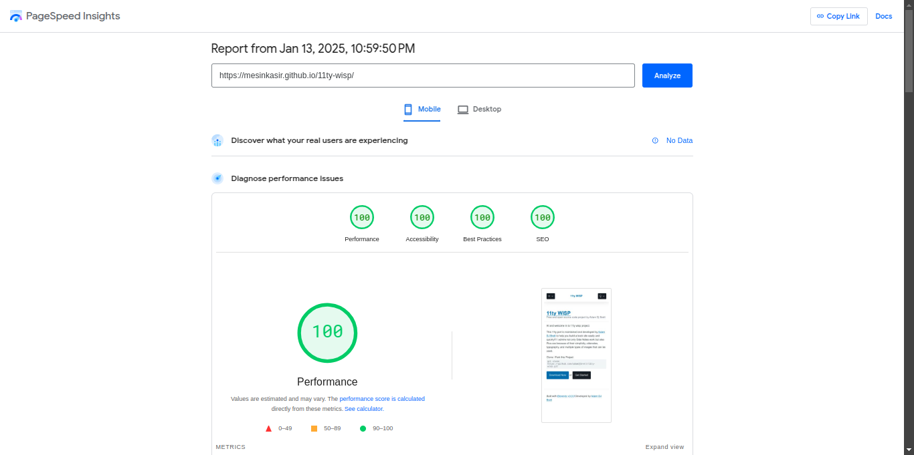
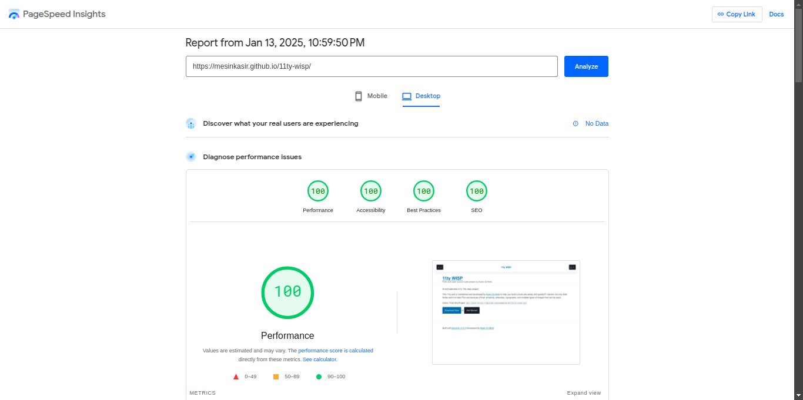

# 11ty-wisp

Building on what I learned from building 11ty gets tufte with tufte.css, I present 11ty wisp built from scratch.
Pun intended :)

Developer [Adam Dj Brett](https://adamdjbrett.com)

If you need help or want to consult about your project, don’t hesitate to contact me.

[info@adamdjbrett.com](mailto:info@adamdjbrett.com)
----
## CHANGELOG
* Make the header match the background color like on [eddy](https://eddy.000000076.xyz/)
* show a subtitle in *italics* under the title
* Move the next and previous buttons for posts to from the header to down below
* remove unused CSS
* enable minify CSS, JS, and text compression
* tab focus select needs to be more visible
* add a disclaimer notice box as a styling option.

----

## Mobile Peform

---

## Desktop Peform

---

## Features
+ 11ty aka Eleventy
+ Pico CSS
+ Home page
+ Static Page
+ Search Pagefind
+ Documentation List
+ Documentation Post
+ Pagination Docs
+ Blog List
+ Blog Post
+ Pagination Post
+ Pagination Blog
+ Blockquote Full Width
+ Blockquote Small
+ Side Note Default
+ Side Note with Blockquote
+ Side Note with Image
+ Side Note with Video
+ Side Note with Link
+ Side Note Numeric Default
+ Side Note Numeric with Blockquote
+ Side Note Numeric with Image
+ Side Note Numeric with Video
+ Side Note Numeric with Link
+ Side Note Numeric Link ID Default
+ Side Note Numeric Link ID with Blockquote
+ Side Note Numeric Link ID with Image
+ Side Note Numeric Link ID with Video
+ Side Note Numeric Link ID with Link
+ Full Width Card
+ Small Card
+ Full Width Image
+ Small Image
+ Full Width Video
+ Small Video
+ Yaml Data
+ Tags List
+ Tags Page Detail
+ Dark Mode
+ Light Mode
+ Auto Mode
+ And More..

