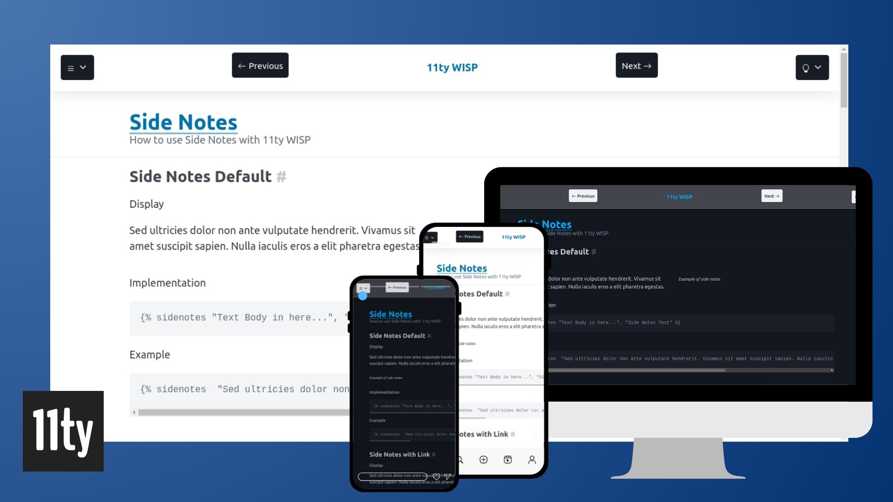
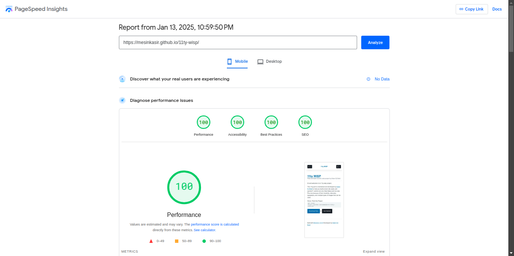
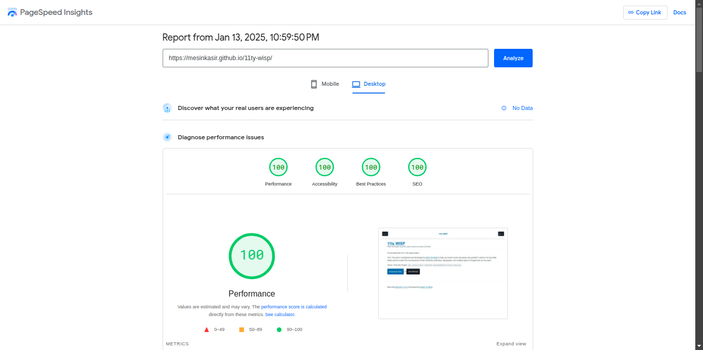

# 11ty-wisp

Building on what I learned from building 11ty gets tufte with tufte.css, I present 11ty wisp built from scratch.
Pun intended :)

Developer [Adam DJ Brett](https://adamdjbrett.com)

If you need help or want to consult about your project, don’t hesitate to contact me.

[info@adamdjbrett.com](mailto:info@adamdjbrett.com)
----
## Deploy to Cloudflare

The site deploys to **Cloudflare Workers static assets**. `wrangler.jsonc` serves the Eleventy output (`_site`), and `.github/workflows/deploy.yml` builds on every pull request and deploys pushes to `main`.

### One-time setup

1. **Add the repository secrets** under *Settings → Secrets and variables → Actions*:

   | Secret | Where to get it |
   | --- | --- |
   | `CLOUDFLARE_API_TOKEN` | Cloudflare → My Profile → API Tokens → Create Token → **Edit Cloudflare Workers** template |
   | `CLOUDFLARE_ACCOUNT_ID` | Cloudflare → Workers & Pages → Account ID |

2. **Retire the old Pages project.** This repo was previously wired to a Cloudflare *Pages* project also named `11ty-wisp`, whose builds were failing. Pages and Workers are separate products, so leaving both connected deploys the site twice. In the dashboard, open the Pages project → *Settings → Builds* and disconnect the Git integration (or delete the project).

3. **Move the custom domain.** `wisp.000000076.xyz` points at the Pages project. Remove it from Pages *first* — Cloudflare will not let two projects claim the same hostname — then add it to the Worker under *Workers & Pages → 11ty-wisp → Settings → Domains & Routes*. Until then the Worker is reachable at `11ty-wisp.<your-subdomain>.workers.dev`.

### Everyday use

Pushes to `main` deploy automatically. Locally, `npm run deploy` builds and runs `wrangler deploy`, and `npm run preview` serves the built site through Workers. Both call `npx wrangler@4`, pinned to the same major the CI action uses so local and deployed behaviour cannot drift. To install it into the project instead, run `npm i -D wrangler` and commit the updated `package-lock.json` — `npx` will then use the local copy as long as it satisfies the pin.

### Notes

The Node version comes from `.nvmrc` (24), which matches `engines.node` in `package.json`. Both Cloudflare's build image and `actions/setup-node` read `.nvmrc`, so keep it in sync with `engines` — a mismatch here is what broke the previous deployments. Response headers live in `public/_headers`, copied to the root of `_site` during the build.

----
## CHANGELOG
* Make the header match the background color like on [eddy](https://eddy.000000076.xyz/) - fix
* show a subtitle in *italics* under the title - fix
* Move the next and previous buttons for posts to from the header to down below - fix
* remove unused CSS - fix
* enable minify CSS, JS, and text compression - fix
* tab focus select needs to be more visible - fix we can change color on metadata
* add a disclaimer notice box as a styling option. - fix we can change color on metadata

----

## Mobile Peform

---

## Desktop Peform

---

## Features
+ Build Awesome (Eleventy)
+ Blades CSS
+ Home page
+ Static Page
+ Search Pagefind
+ Documentation List
+ Documentation Post
+ Pagination Docs
+ Blog List
+ Blog Post
+ Pagination Post
+ Pagination Blog
+ Blockquote Full Width
+ Blockquote Small
+ Side Note Default
+ Side Note with Blockquote
+ Side Note with Image
+ Side Note with Video
+ Side Note with Link
+ Side Note Numeric Default
+ Side Note Numeric with Blockquote
+ Side Note Numeric with Image
+ Side Note Numeric with Video
+ Side Note Numeric with Link
+ Side Note Numeric Link ID Default
+ Side Note Numeric Link ID with Blockquote
+ Side Note Numeric Link ID with Image
+ Side Note Numeric Link ID with Video
+ Side Note Numeric Link ID with Link
+ Full Width Card
+ Small Card
+ Full Width Image
+ Small Image
+ Full Width Video
+ Small Video
+ Yaml Data
+ Tags List
+ Tags Page Detail
+ Dark Mode
+ Light Mode
+ Auto Mode
+ Minify CSS , JS
+ Minify Text Brotli
+ And More..
